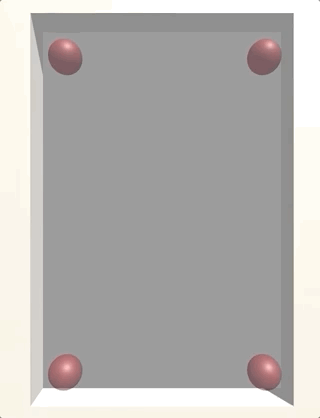

# GourdPool

GourdPool is a utility package for quickly and easily pooling GameObjects in Unity.

This repository contains the UPM package only. The Unity demo project with examples can be found here: https://github.com/mjstephens/GourdPool_Demo   

---
**Creating Pools**

GourdPool comes with the classes needed to quickly create and use pools for any object. 

Typical object instantiation looks like this:

>GameObject myObj = Instantiate(prefabReference);
  
This will instantiate a new instance of the prefab, allocating the required memory along the way. For GameObjects you will be reusing frequently, it's better to _pool_ them. This refers to the process of reusing instances that have already been allocated whenever possible. So instead of destroying the object when you are done with it, you simply _relinquish_ it to a pool. Then, the next time an instance of that object is required, you can reuse that instance, saving yourself the memory allocation.

GourdPool automatically creates, manages, and references pools for every object you need. If a pool does not yet exist for your object, a new one will be automatically created. Simply replace the above instantiation logic with the following:

>GameObject myObj = GourdPool.Pooled(prefabReference);

It's that easy! If there are no instances available, a new one will be instantiated, but if there are available instances in the pool, they will be reused. *This one method is used for all pooled object spawning.*

----
 

The yellow cubes are instantiated, allocating memory for each instance. The blue cubes are identical prefabs (with a color change at runtime) - but, the blue cubes are _reused instances of previously spawned objects_. Spawning is identical; the same call to _GourdPool.Pooled_.

----

**Returning Objects to Pools**

It's important to remember that when you're dealing with pooled objects, you should _disable_ rather than _destroy_ them. GourdPool automatically hooks into the OnDisable() callback of pooled objects, so you don't need to worry about manually managing the pool references. Just call:

>myObj.SetActive(false);

and it will automatically be relinquished to the pool for future reuse.

----

**Pool Capacities**

By default, pools are configured to expand infinitely. That is, they have no upper limit on the number of instances they can hold.

MAX CAPACITY

Sometimes you may wish to define a maximum capacity for a pool. This limits the number of possible concurrent instantiated instances. If you request a new pooled instance, and the max capacity has been reached (AND all of the instances are in use) the pool will automtically _recycle_ the OLDEST (i.e. longest in use) instance. Of course, if that instance is clearly visible and/or being used for important purposes, recycling it will result in potentially incorrect behavior.

When a pool's max capacity is set, the pool will immediately destroy any excess instances. To configure a pool with unlimited capacity, simply set the max capacity value to -1.

MINIMUM CAPACITY

You can also define a minimum capacity for a pool; this has the effect of _prewarming_ a pool with a set number of instances for later use. If you know you will need a certain number of an object sometime in the future, you can use a pool's minimum capacity to offset the instantiation cost of those objects to whenever you'd like.

When a pool's minimum capacity is set, the pool will immediately instantiate as many instances as needed to reach the minimum capacity value.
